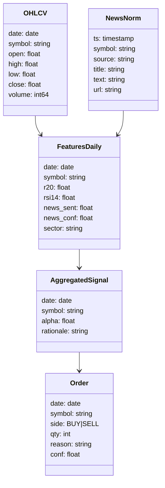

# Modular Trading Suite — Sprint Plan & Design Doc

> **Scope:** Build a modular, research-oriented end‑to‑end trading suite for **U.S. equities** (extensible to other markets) using **LLM agents**, **Deep RL**, **HRM** for synthesis/justification, and a **True Confidence** uncertainty module. This doc is formatted for Obsidian and includes Mermaid diagrams.

---

## 0) Objectives (This Sprint, 2–3 weeks)
- ✅ Stand up a **minimal but modular pipeline**: ingest → preprocess → features → agents → aggregate (HRM placeholder) → decide → execute (paper) → evaluate.
- ✅ Enforce **data contracts** (schemas) and packaging so modules are **swappable** (LLM ↔ HRM, RL ↔ rules, etc.).
- ✅ Deliver a working **daily-frequency** strategy MVP (news sentiment + momentum) trading a **small US universe** via **Alpaca Paper**.
- ✅ Baseline **evaluation dashboard** (equity curve, Sharpe, drawdown) and **experiment tracking**.
- ✅ Produce a **tech stack and API integration** skeleton for full system.

---

## 1) Team Assignments (Specific, Actionable)

### A. Data Engineering
**Owner:** 
**Co‑owner:** 

Obsidian: [[Module-Data-Engineering]]

- **A1. Market Data APIs (prices/volume):**
  - Integrate **Yahoo Finance** (historical) via `yfinance` — [yfinance github](https://github.com/ranaroussi/yfinance)
  - Optional premium: **Polygon.io** — [https://polygon.io/docs/stocks](https://polygon.io/docs/stocks)
  - Write **`ingest_market.py`** to pull OHLCV for a ticker list, store as **Parquet** partitioned by `{date}/{symbol}.parquet` and register to **DuckDB**.
  - yfinance — Overview:
    - What it is: Free Python client to Yahoo Finance providing historical OHLCV, adjusted prices, and some fundamentals.
    - How we use it: Daily bars (adjusted close), OHLCV including `volume`; backfills and daily updates; write Parquet and register in DuckDB.
    - Use cases: MVP historical data source; baseline OHLCV across initial universe.
    - FAQ:
      - Freshness: Daily historical and near real-time quotes available; sufficient for daily pipeline.
      - Volume: Included in OHLCV and mapped to `ohlcv_daily.volume`.
      - Limits: Occasional data quirks; cache snapshots to stabilize runs.
  - Polygon.io — Overview (optional):
    - What it is: Paid market data with intraday aggregates, trades/quotes, and websockets.
    - How we use it: Optional higher-fidelity source for intraday research and validation; same schema via ingestion abstraction.
    - Use cases: Intraday features, data quality checks, optional live validations.
    - FAQ:
      - Rate limits/pricing: Provider dependent; gate behind config.
      - Schema: Map to the same Parquet/DuckDB contract as yfinance for swapability.
- **A2. Fundamentals:**
  - **Financial Modeling Prep (FMP)** — [https://site.financialmodelingprep.com/developer/docs](https://site.financialmodelingprep.com/developer/docs)
  - **SEC EDGAR** (10‑K/10‑Q) — [https://www.sec.gov/edgar](https://www.sec.gov/edgar)
  - Write **`ingest_fundamentals.py`** to fetch quarterly fundamentals → normalized table (see schema below).
  - FMP — Overview:
    - What it is: API for financial statements, ratios, and company metadata.
    - How we use it: Quarterly fundamentals to populate normalized table per `catalog.yml`.
    - Use cases: Factor features (profitability, leverage), screening, sanity checks.
    - FAQ:
      - Coverage: Good for US equities; verify tickers on ingestion.
      - Rate limits: Cache responses; schedule backfills offline.
  - SEC EDGAR — Overview:
    - What it is: Official SEC filings (10‑K/10‑Q) portal.
    - How we use it: Source of truth for filings; optional text for NLP; cross-check against FMP.
    - Use cases: Event alignment, text-derived features (later), auditing.
    - FAQ:
      - Rate limiting: Respect SEC guidance; throttle and cache filings.
      - Parsing: Start with metadata; full text parsing later.
- **A3. News / Social:**
  - **NewsAPI** (headlines) — [https://newsapi.org](https://newsapi.org)
  - **Reddit API** (r/stocks, r/investing) — [https://www.reddit.com/dev/api](https://www.reddit.com/dev/api)
  - **X/Twitter** (if available) — [https://developer.x.com](https://developer.x.com)
  - Build **`ingest_news.py`** with ticker mapping & dedup, and **`normalize_text.py`** for cleaning.
  - NewsAPI — Overview:
    - What it is: Aggregated news headlines API.
    - How we use it: Pull ticker-mapped headlines for sentiment; deduplicate and normalize.
    - Use cases: Daily news-driven features; event windows around earnings.
    - FAQ:
      - Limits: Free tier ~100 req/day; cache responses and snapshot Parquet.
      - Ticker mapping: Maintain symbol aliases; fall back to company name match.
  - Reddit API — Overview:
    - What it is: API for subreddit posts/comments.
    - How we use it: Optional social sentiment augmentation (r/stocks, r/investing).
    - Use cases: Retail sentiment proxy; anomaly signals.
    - FAQ:
      - Noise: Apply dedup and basic filters; treat as secondary signal in MVP.
      - Rate limits: Respect API limits; batch pulls.
  - Normalize Text — Overview:
    - What it is: Cleaning pipeline for raw text (lowercasing, Unicode normalization, URL stripping).
    - How we use it: Standardize text pre-sentiment; ensure reproducible tokenization.
    - Use cases: Improve sentiment quality; reduce variance.
    - FAQ:
      - Dedup strategy: Hash title+source+timestamp; keep latest when conflicts.
      - Ticker mapping: Maintain allowlist per universe; avoid over-matching.
- **A4. Storage & Registry:**
  - Stand up [**DuckDB**](https://duckdb.org/) file DB (`./data/trading.duckdb`) plus **Parquet lake** at `./data/lake/`.
	  - **DuckDB — Overview:** In‑process analytics over Parquet with zero setup; register Parquet directories as views; use SQL for joins/rolling windows.
	  - **Parquet — Overview:** Columnar storage for lake partitions with zstd compression; partition by `{date}/{symbol}` where appropriate.
	  - **Great Expectations — Overview:** Data validation suites per dataset; nightly checks; fail on schema drift/null anomalies.
  - Add **dataset registry** YAML (see Section 2) and **data validation** with **Great Expectations** — [https://greatexpectations.io/](https://greatexpectations.io/). 

**Deliverables:**
- `data/` with populated **OHLCV**, **fundamentals**, **news** partitions.
- `catalog.yml` (dataset registry), validation reports in `reports/data_quality/`.

---

### B. NLP / LLM Agents
**Owner:** 
**Co‑owner:** 

Obsidian: [[Module-NLP-and-LLM-Agents]]

- **B1. Sentiment Agent (MVP):**
  - Implement **FinBERT** pipeline via `transformers` for financial sentiment. Model card: **ProsusAI/finbert** — [https://huggingface.co/ProsusAI/finbert](https://huggingface.co/ProsusAI/finbert)
  - Input: normalized news headlines per ticker (T‑1, T‑0). Output: `sentiment_score ∈ [-1,1]`, `confidence`.
- **B2. Fundamentals Agent (Phase-in):**
  - Start prompt-template for **FinR1‑style** reasoning or **local Llama 7B** fine-tuned Q&A (post‑training later). Reference (FinR1): [https://huggingface.co/collections/FinNLP/fin-r1-65f5f41f01b41e7877f7](https://huggingface.co/collections/FinNLP/fin-r1-65f5f41f01b41e7877f7)
- **B3. Agent Wrapper:**
  - Define **`AgentAPI`** interface (sync + batch) and package a `sentiment_agent` module returning **typed** dataframes that conform to the **feature contract** (Section 2).

**Deliverables:**
- `agents/sentiment/` with callable `run_sentiment(df_news)->df_sentiment`.
- Tests: latency, accuracy sanity (label a tiny set by hand).

---

### C. Decision & Reasoning (Aggregator + RL)
**Owner:** 
**Co‑owner:** 

Obsidian: [[Module-Decision-and-Reasoning]]

- **C1. Aggregator V0 (Rules):**
  - Combine **sentiment z‑score** and **momentum** (e.g., 20‑day return) into `alpha_score`. See [[Module-Decision-Aggregator-V0|Module: Decision/Aggregator V0]].
  - Rules: `alpha>t_buy → buy`, `alpha<t_sell → sell`, else hold.
- **C2. HRM Placeholder:**
  - Add **reasoning stub** that logs factors used and a one‑paragraph justification template. See [[Module-Decision-HRM-Stub|Module: Decision/HRM Stub]]. (HRM integration in next sprint.)
- **C3. RL Track (parallel spike):**
  - Portfolio **PPO** (daily rebalancing) using `stable-baselines3` — [https://stable-baselines3.readthedocs.io](https://stable-baselines3.readthedocs.io) (see [[Tech-Stable-Baselines3|Tech: SB3]]).
  - State: {top‑k features incl. sentiment, momentum, risk metrics}. Action: target weights. Reward: daily portfolio return with risk penalties. See [[Module-RL-PPO-Portfolio-Spike|Module: RL/PPO Portfolio Spike]].
- **C4. Uncertainty (“True Confidence”):**
  - Implement **meta‑labeling** classifier `P(success|context)` using last N trades & market context; threshold drives **position scaling**. See [[Choice-Meta-Labeling|Choice: Meta-Labeling (True Confidence)]].

**Deliverables:**
- `decision/aggregator_v0.py` + config thresholds.
- `rl/ppo_portfolio_spike.py` (runs on synthetic env; hooks ready).

---

### D. Execution & Evaluation
**Owner:** 
**Co‑owner:** 

Obsidian: [[Module-Execution-and-Evaluation]]

- **D1. Execution:**
  - **Alpaca Paper** integration — [https://alpaca.markets/docs/api-references/trading-api/](https://alpaca.markets/docs/api-references/trading-api/) (see [[Tech-Alpaca|Tech: Alpaca]])
  - Orders: market (MVP). Add config for slippage assumptions in backtest. See [[Module-Exec-Alpaca|Module: Exec/Alpaca]].
- **D2. Backtesting:**
  - **Backtrader** — [https://www.backtrader.com/docu/](https://www.backtrader.com/docu/) (see [[Tech-Backtrader|Tech: Backtrader]])
  - Implement adapter: same **signals → orders** interface for both backtest and live. See [[Module-Exec-Backtester|Module: Exec/Backtester]].
- **D3. Evaluation & Tracking:**
  - Metrics: return, vol, **Sharpe**, **max DD**, turnover; per‑asset PnL.
  - **MLflow** experiment tracking — [https://mlflow.org](https://mlflow.org). Artifact: equity curve, trade logs. See [[Tech-MLflow|Tech: MLflow]].
  - Optional dashboard: **Streamlit** quick app — [https://streamlit.io](https://streamlit.io) (see [[Tech-Streamlit|Tech: Streamlit]])

**Deliverables:**
- `exec/alpaca_client.py`, `exec/backtester.py`
- `eval/metrics.py`, `eval/report.ipynb` and `mlruns/` populated.

---

### E. Platform & Ops
**Owner:** 
**Co‑owner:** 

Obsidian: [[Module-Platform-and-Ops]]

- **E1. Repo & Env:**
  - Monorepo `trading-suite/` with **Poetry** or **uv**; Python 3.11. See [[Tech-Poetry|Tech: Poetry]] and [[Tech-uv|Tech: uv]].
  - **Dockerfile**; **devcontainer** for VSCode. See [[Tech-Docker|Tech: Docker]] and [[Tech-Devcontainer|Tech: Devcontainer]].
- **E2. Config & Orchestration:**
  - **Hydra/OmegaConf** config trees — [https://hydra.cc](https://hydra.cc)
  - **Prefect** for scheduled jobs (daily runs) — [https://www.prefect.io](https://www.prefect.io)
- **E3. CI:**
  - GitHub Actions: unit tests, lint (`ruff`), typecheck (`mypy`).

**Deliverables:**
- `pyproject.toml`, `docker/Dockerfile`, `.github/workflows/ci.yml`
- `conf/` with separate profiles for **backtest**, **paper**.

---

## 2) Data Packaging & Contracts (Modular Interfaces)

### 2.1 Lake Layout
```
data/
  lake/
    ohlcv/          # partitioned by date/symbol
    fundamentals/
    news_raw/
    news_norm/
    features/       # finalized training/inference features
  trading.duckdb
catalog.yml         # dataset registry (URIs, schemas, freshness SLA)
```

### 2.2 Dataset Registry (`catalog.yml`) — Example
```yaml
datasets:
  ohlcv_daily:
    uri: data/lake/ohlcv
    format: parquet
    partitioning: [date, symbol]
    schema:
      - {name: date,    type: date}
      - {name: symbol,  type: string}
      - {name: open,    type: float}
      - {name: high,    type: float}
      - {name: low,     type: float}
      - {name: close,   type: float}
      - {name: volume,  type: int64}
  news_norm:
    uri: data/lake/news_norm
    format: parquet
    schema:
      - {name: ts,      type: timestamp}
      - {name: symbol,  type: string}
      - {name: source,  type: string}
      - {name: title,   type: string}
      - {name: text,    type: string}
      - {name: url,     type: string}
  features_daily:
    uri: data/lake/features/daily
    format: parquet
    schema:
      - {name: date,    type: date}
      - {name: symbol,  type: string}
      - {name: r20,     type: float}     # 20D return
      - {name: rsi14,   type: float}
      - {name: news_sent, type: float}
      - {name: news_conf, type: float}
      - {name: sector,  type: string}
```

### 2.3 Feature Contract (Inference IO)
- **Input:** `features_daily` for `{date, symbol}` including required fields for the current strategy.
- **Agent Output Contract:**
  - `sentiment_agent`: `{date, symbol, news_sent: float in [-1,1], news_conf: float in [0,1]}`
  - `fundamentals_agent`: `{date, symbol, fund_score: float}`
- **Decision Contract:**
  - `aggregated_signal`: `{date, symbol, alpha: float, rationale: string}`
  - `orders`: `{date, symbol, side: {BUY|SELL}, qty: int, reason: string, conf: float}`

### 2.4 Validation
- **Great Expectations** suites for each dataset; nightly CI run fails on schema drift or null anomalies.
- **Time‑causality checks** (no future leakage): feature timestamps ≤ decision timestamp.

---

## 3) Mermaid Diagrams

### 3.1 End‑to‑End Pipeline
```mermaid
flowchart TD
  subgraph Ingestion
    A[OHLCV APIs] -->|yfinance/Polygon| B[OHLCV Parquet]
    C[Fundamentals APIs] --> D[Fundamentals Parquet]
    E[News/Social APIs] --> F[News Raw Parquet] --> G[News Normalized]
  end
  subgraph Features
    B --> H[Tech Indicators]
    G --> I[Sentiment Agent]
    D --> J[Fundamentals Agent]
    H & I & J --> K[features_daily]
  end
  subgraph Decision
    K --> L[Aggregator (HRM stub)]
    L --> M[RL (PPO) or Rules]
    M --> N[Orders]
  end
  subgraph Execution
    N --> O[Backtrader / Alpaca Paper]
  end
  subgraph Evaluation
    O --> P[Metrics + MLflow]
    L --> P
    K --> P
  end
```

### 3.2 Data Contracts Overview


---

## 4) Design Choices — Rationale (1 paragraph each)

### 4.1 Daily Frequency First
We target **daily rebalancing** initially: 
- balances signal freshness (news/earnings) with compute and latency constraints of LLMs/HRM
- It yields ~250 decision points/year per asset (ample for robust evaluation), works well with **sentiment + momentum** factors, and allows heavy NLP processing overnight 
- Intraday is supported later by decoupling heavy agents (hourly updates) from a lightweight RL policy loop, while **ultra‑HFT** is out of scope due to latency and infra complexity.

### 4.2 US Large/Mid‑Cap Universe
- Start with **S&P 500** (or top‑300 by ADV) to ensure liquidity, tight spreads, and reliable data. 
	- We can move into small caps, where our processing might have an advantage, but we would need to set liquidity conditions. This means new data streams.
- This reduces slippage and borrow constraints for potential shorting. 
- The universe definition is configurable (YAML) so we can swap to **Russell 1000**, **crypto**, or **CSI 300** with only ingestion changes, keeping model/reasoning modules intact.

### 4.3 Open Weights First (LLMs)
- Use [**FinBERT**](https://huggingface.co/ProsusAI/finbert) for sentiment MVP and plan [**FinR1**](https://github.com/SUFE-AIFLM-Lab/Fin-R1/blob/main/README_en.md) / [**Llama‑3-8B**](https://huggingface.co/meta-llama/Meta-Llama-3-8B) post‑training for fundamentals reasoning to avoid vendor lock‑in, control costs, and maintain observability. 
- Proprietary APIs (e.g., GPT‑4) remain optional for **one‑off research** and report generation but are excluded from automated loops to minimize latency, cost, and data governance risks.

### 4.4 HRM at Aggregation/Justification
- HRM’s planner‑executor structure is well‑suited to **conflict resolution** across signals (sentiment vs fundamentals vs momentum) and to produce **auditable rationales**. 
- We begin with a stub that records explicit reasons and confidence weights, then slot in HRM once the data contracts are stable. This separation of **analysis (agents)** and **synthesis (HRM)** mirrors human investment committees and simplifies debugging.

### 4.5 RL for Portfolio & Execution (PPO first)
For portfolio sizing under transaction costs and risk constraints, an **on‑policy PPO** is stable and easy to regularize. For execution, later phases can add **SAC** or a dedicated policy trained in a slippage simulator to beat naive VWAP/TWAP. RL is optional in v0 (rules suffice) but becomes valuable as feature richness grows and sequential trade‑offs matter (e.g., risk‑aware scaling and dynamic exposure).

### 4.6 Uncertainty via Meta‑Labeling
We implement **meta‑labeling** to predict trade success conditioned on context (volatility, dispersion of signals, regime) and use it to modulate **position size** or filter trades. It is simpler, data‑efficient, and empirically robust compared to full Bayesian policies. It also provides a single controllable threshold for risk appetite (raise threshold → fewer, higher‑conviction trades).

### 4.7 Storage: Parquet + DuckDB + Contracts
**Parquet** gives columnar performance and portability; **DuckDB** enables in‑process analytics (fast joins and rolling windows) without a heavy DB server. **Data contracts** (schemas + expectations) make agents hot‑swappable and catch drift early. This avoids “silent corruption” and accelerates collaboration among teams by defining strict IO for every module.

### 4.8 Orchestration & Reproducibility
**Prefect** schedules daily flows and retries transient API failures; **Hydra** config profiles (backtest/paper/live) ensure reproducibility across runs. **MLflow** centralizes metrics, artifacts, and params for experiment comparability. This stack balances simplicity and industrial reliability without locking us into heavy cloud platform dependencies.

---

## 5) Concrete “Day‑1” Checklist

- [ ] Create repo `trading-suite/` with Poetry/uv, Dockerfile, CI.
- [ ] Implement `ingest_market.py`, `ingest_news.py`, `ingest_fundamentals.py` writing to Parquet + register in DuckDB.
- [ ] Build `normalize_text.py` and `features/daily.py` (add RSI14, 20D return).
- [ ] Implement `agents/sentiment/finbert_agent.py` → write `news_sent`, `news_conf`.
- [ ] Implement `decision/aggregator_v0.py` (rules + rationale string).
- [ ] Backtester adapter + Alpaca Paper client; dry‑run single ticker (AAPL) for a week.
- [ ] `eval/metrics.py` + MLflow logging; generate first equity curve.
- [ ] Prefect flow `flows/daily_run.py` with backtest and paper modes.
- [ ] GE data checks; fail if nulls or timestamp drift detected.

---

## 6) Repository Layout (Proposed)
```
trading-suite/
  conf/
    base.yaml
    profiles/
      backtest.yaml
      paper.yaml
  data/ (gitignored)
  agents/
    sentiment/
      finbert_agent.py
    fundamentals/
      prompts/
  decision/
    aggregator_v0.py
    hrm_stub.py
  rl/
    ppo_portfolio_spike.py
  exec/
    alpaca_client.py
    backtester.py
  eval/
    metrics.py
    report.ipynb
  features/
    daily.py
  ingestion/
    ingest_market.py
    ingest_news.py
    ingest_fundamentals.py
    normalize_text.py
  pipelines/
    build_features.py
  flows/
    daily_run.py
  tests/
  docker/
    Dockerfile
  pyproject.toml
  README.md
```

---

## 7) API Keys & Rate Limits (Notes)
- Store keys in **.env** (dotenv) and map via Hydra (`conf/base.yaml`).  
- Respect provider limits (e.g., NewsAPI ~100 req/day free). Use **caching** (Parquet snapshots) to avoid re‑hitting endpoints.  
- Backfill historical data offline to remove API latency from daily runs.

---

## 8) Risks & Mitigations
- **Data Leakage / LLM prior knowledge:** strict **time cuts**, rolling features, forward‑only backtests; prefer open‑weights with known cutoffs.
- **Overfitting:** walk‑forward validation, hold‑out calendar months, report **p‑values** (White’s Reality Check variants later).
- **Latency (intraday):** decouple heavy NLP from decision loop; precompute hourly; keep RL policy small.
- **Ops reliability:** Prefect retries, idempotent tasks, circuit‑breakers on drawdown, Slack alerts on failures.

---

## 9) Success Criteria (Sprint Exit)
- End‑to‑end daily pipeline **runs on schedule**, logs to MLflow, executes to Alpaca Paper, and produces a **baseline positive‑expectancy** backtest (even if modest) with interpretable rationale logs.
- All modules read/write via **contracts**, enabling plug‑and‑play iterations next sprint (HRM, RL).

---
